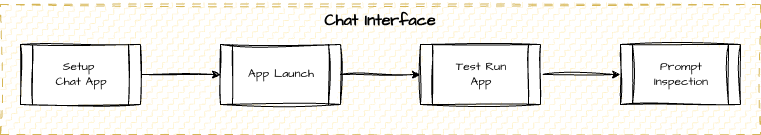

# Intro to RAG Workshop Syllabus
## Outcome-Focused Module Matrix + Timeline

**Course:** Build Your Own AI-Powered Document Search (2-hour hands-on workshop)  
**Prerequisites:** Python comfort + completed pre-work  
**Participants:** 5–10 developers

---

## PRE-WORK (Completed 24 hours before)

**Purpose:** Ensure participants arrive with working environment and baseline understanding.

### What Participants Will Do
1. Clone workshop repository from GitHub
2. Run environment verification script (`verify_setup.py`)
   - Confirms Python installation, package manager (UV) installed, key packages available
   - Success: ✓ All checks passed
3. Choose or prepare corpus:
   - Use provided sample corpus (recommended), OR
   - Prepare own markdown documents (5–10 files, ~500 words each)
4. Set up API credentials:
   - Obtain free-tier LLM API key (Free OpenRouter API will be available if needed)

### Instructor Support
- Email pre-work guide 1 week before
- Insturctors will be avialable at venue 30 minutes before event for possible support

### Fallback Plan
- **If pre-work incomplete:** Provide with generic pre-work set (??)
- **If environment fails:** Have pre-built Docker container or cloud IDE backup ready

---

## LIVE SESSION: 120 MINUTES

| **Segment** | **Duration** | **Outcome** |
|---|---|---|
| **Opening** | 0–20 min | Everyone understands RAG problem, environment verified |
| **Module 1: Ingest & Embed** | 20–55 min | 40–50 chunks created, stored in ChromaDB |
| *Break* | 55–60 min | — |
| **Module 2: Query & Retrieve** | 60–90 min | Participants write queries, interpret similarity search |
| **Module 3: Chat Interface** | 90–110 min | Streamlit app running, tested with live Q&A |
| **Wrap-Up** | 110–120 min | Next steps identified, feedback collected |

---

## OPENING (0–20 minutes)

### Learning Outcomes
- Understand why RAG exists and what problem it solves
- Verify everyone's environment is working
- Get oriented to the RAG loop diagram

### Content
- Welcome, introductions, environment check
- Helper assists stragglers with `verify_setup.py`
- RAG conceptual primer: LLM hallucination demo → why RAG solves it (context window as steering lever)
- RAG loop diagram: Ingest → Embed → Retrieve → Generate → Chat UI
- Teaser: 30-second demo of finished chat app

### Activities
| **Activity** | **Duration** | **Format** |
|---|---|---|
| Welcome & intros | 3 min | Group |
| Environment check | 5 min | Live (everyone runs verify_setup.py) |
| RAG primer | 10 min | Demo + discussion |
| Teaser & loop diagram | 2 min | Slide/whiteboard |

### Discussion Prompts
- "Has anyone used ChatGPT on a document? What happened?"
- "What information does ChatGPT NOT have access to?"

---

## MODULE 1: INGEST & EMBED (20–55 minutes)

### Learning Outcomes

- Parse document formats and extract metadata
- Explain chunking strategy and why overlap matters
- Describe the embedding process and what vectors represent
- Use ChromaDB API to store and manage collections

### Content
- Corpus structure walkthrough (markdown + frontmatter)
- Load documents from directory
- Extract metadata (title, author, date)
- Chunk with fixed-size + overlap strategy (explain tradeoffs)
- Call embedding API; explain vector representation
- Store in ChromaDB

### Activities
| **Activity** | **Duration** | **Format** |
|---|---|---|
| Corpus walkthrough | 5 min | Live demo |
| Live code-along: Load | 5 min | Instructor codes; participants follow |
| Live code-along: Chunk | 7 min | Instructor codes; participants follow |
| Live code-along: Embed & store | 8 min | Instructor codes; participants follow |
| Checkpoint: Run ingest | 5 min | Participants run on own corpus |
| Debrief discussion | 5 min | Whole group Q&A |

### Key Takeaways 
- Metadata enables explainability
- Chunking is a tuning knob (size, overlap affect embedding quality)
- Embeddings capture semantic meaning, not keywords

---

## BREAK (55–60 minutes)

---

## MODULE 2: QUERY & RETRIEVE (60–90 minutes)

### Learning Outcomes

- Visualize embedding space and understand similarity-based search
- Encode queries and search vector DB
- Interpret similarity scores and top-k results
- Recognize tuning parameters (top-k, threshold, metadata filters)

### Content
- Embedding space visualization (2D plot analogy)
- Similarity search algorithm and distance metrics
- Query encoding (same model as documents)
- ChromaDB query API (`n_results`, `similarity_score`)
- Interpreting results: score thresholds, metadata
- Introduction to reranking (concept only)

### Activities
| **Activity** | **Duration** | **Format** |
|---|---|---|
| Whiteboard: Embedding space | 8 min | Instructor draws + explains (SQL analogy for experienced) |
| Live code-along: Query encode | 3 min | Instructor codes |
| Live code-along: Retrieval Basic | 5 min | Instructor codes |
| Live code-along: Retrieval Strategies | 8 min        | Participants write 3 queries                              |
| Tuning discussion                     | 2 min        | Potential alternative retrievers and finetuning           |

### Key Takeaways
- Similarity search is probabilistic, not binary
- You have tuning knobs (top-k, threshold, filters)
- Embedding model's training affects search
- Rerankers exist to improve relevance (advanced topic reference)

---

## MODULE 3: CONNECT TO CHAT (90–110 minutes)

### Learning Outcomes

- Setup and interact with a chat application
- Understand full RAG pipeline from query to response
- Recognize system prompt as steering mechanism
- Distinguish retrieval problems from generation problems

### Content
- Streamlit app architecture and UI
- API key setup and verification
- Running the chat app
- Full RAG loop in action: query → retrieve → generate → display
- System prompt inspection and editing
- Debugging: when retrieval fails vs. when generation fails

### Activities
| **Activity** | **Duration** | **Format** | **Success Signal** |
|---|---|---|---|
| Demo: Chat app overview | 3 min | Instructor shows UI + debug window | Participants understand full flow |
| Setup: Verify API keys | 2 min | Helpers spot-checks | 80%+ have valid `.env` keys |
| Run app: Participants launch | 8 min | Each person starts locally | "Streamlit running at localhost:8501" |
| Interactive testing | 5 min | Participants ask questions | Everyone gets responses |
| Prompt inspection | 3 min | Instructor opens + edits system prompt | Participants see how prompt affects output |

### Key Takeaways
- RAG handles data retrieval; system prompt handles personality
- Full pipeline visibility (debug window) aids debugging
- When it fails, diagnose: retrieval or generation?

---

## WRAP-UP (110–120 minutes)

### Learning Outcomes (Specific)

- Recap complete RAG architecture
- Looking at possible extensions (custom corpus, tuning parameters)
- Considering deployment paths (Bedrock, Databricks, etc.)
- Considering advanced topics (training/finetuning, alternative retrievers, reranking, metadata filtering, etc.)

### Content
- RAG loop recap diagram
- Immediate next steps:
  - Swap own corpus
  - Tune chunking parameters
  - Try different embedding models (Hugging Face)
- Deployment options:
  - ChromaDB Cloud → Bedrock, Databricks, etc.
  - Streamlit → ????
  - Local → managed LLM API
- Advanced topics (in repo README):
  - Finetuning Embedding & Retriever
  - Alternative Retrievers & Rerankers
  - Metadata filtering
  - Hybrid search
  - Frameworks (Langchain, LlamaIndex)
  - Enterprise (Bedrock, DataBricks)

### Activities
| **Activity** | **Duration** | **Format** | **Success Signal** |
|---|---|---|---|
| Recap + diagram | 3 min | Instructor displays | Participants see full loop again |
| Next steps discussion | 4 min | Instructor presents 3 paths | Each person mentally picks one |
| Parking lot collection | 1 min | Instructor writes questions | Topics captured for follow-up |
| Feedback form | 2 min | QR code / link | 80%+ complete survey |

---

**Version:** 1.0 | 03Jan26
