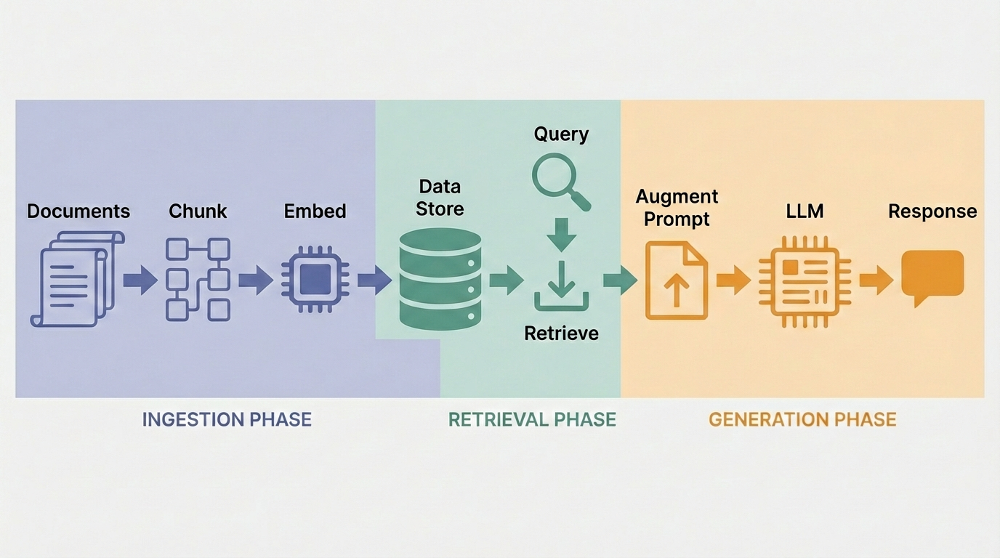

# Module 3: Connect to Chat

**Building the last mile — from retrieval to conversation**

<!-- TODO: Replace with custom rag-chat-phase.png (chat/generation phase zoomed in).
     See image-prompt-seed.txt for style guide. -->


---

# How Does the LLM "Use" RAG?

<!-- This slide is the core conceptual beat of Module 3 -->

It doesn't.

The LLM has **no connection** to your database.
It doesn't know ChromaDB exists.
It doesn't call any retrieval API.

It only sees what's placed in the **context window**.

---

# The Context Window Is the Only Door


<!--
Speaker notes:
- "You built the retrieval pipeline in Modules 1 and 2. Now we connect it to an LLM."
- "But 'connect' is misleading — there's no wire, no API call from the LLM to ChromaDB."
- "The retrieval system fetches relevant chunks and pastes them into the prompt."
- "This is simpler than most people expect."
- CALL OUT: "Notice what's NOT here — there is no line from the Vector Database directly to the LLM. The LLM has zero awareness that a database exists. The Host App does all the work."
-->

---

# What Goes Into the Context Window?

Three things get assembled into every request:

| Component | Who controls it | What it does |
|---|---|---|
| **System Prompt** | You (the developer) | Sets behavior, personality, rules |
| **Retrieved Context** | RAG pipeline | Relevant chunks from your documents |
| **User Message** | The end user | Their question |

The LLM sees **all three combined** as one input. It responds accordingly.

<!--
Speaker notes:
- The system prompt is your steering wheel
- The retrieved context is the knowledge you're injecting
- The user message is what drives the query
- The LLM doesn't distinguish between these — it's all just text
-->

---

# What We'll Do

1. **Tour the Chat RAG Explorer UI** — see the full interface
2. **Send queries** — watch the RAG pipeline in action
3. **Inspect the augmented message** — see exactly what the LLM receives
4. **Compare system prompts** — swap from a basic prompt to a RAG-optimized one
5. **Try your own corpus** *(if available from Module 2)*

Let's open the app.

---

# Our Dataset: The Morn Chronicles

A **Star Trek: Deep Space Nine** fan fiction — ~60,000 words of entirely invented content the LLM has never seen.

| Morn Chronicles | Your World |
|---|---|
| Invented Lurian biology | Internal company docs |
| Morn's backstory | Product documentation |
| Warren family structure | Customer support knowledge base |
| Heist details | Proprietary research & reports |

**The common thread:** Content not in the LLM's training data. RAG is the bridge.

<!--
Speaker notes:
- "Before we demo, let's talk about what data we're working with."
- Quick show of hands: "Anyone a Star Trek fan?"
- Explain Morn: beloved background character who never speaks on screen — we wrote a novel about his life
- Walk through the table: each row maps invented content to a real-world equivalent
- "This is a stand-in for YOUR data. Internal docs, product specs, support articles — anything the LLM hasn't seen."
-->

---

<!-- _class: lead -->

# Live Demo

## Chat RAG Explorer

`http://127.0.0.1:8000`

<!--
Speaker notes:
PRE-DEMO CHECK (2 min):
- Verify your .env has a valid OPENROUTER_API_KEY
- Helpers: spot-check a few participants' .env files
- If anyone needs an API key: https://openrouter.ai/keys — free tier works for this workshop
- Confirm the app is running: http://127.0.0.1:8000

TERMINOLOGY: The syllabus says "debug window" — in the app it's the "Details" button. Same feature.

DEMO FLOW:
1. Show the main chat UI — point out sidebar (model, tokens, parameters, RAG toggle)
2. Point out RAG is enabled, connected to Morn Chronicles collection
3. Note the system prompt is currently "You are a helpful assistant" (non-RAG-aware)
4. Send first query: "What is the Lurian First Molt?"
   - This is entirely INVENTED content — it does NOT exist in LLM training data
   - Without RAG, the LLM would have no idea. With RAG, the chunks are retrieved.
   - But the basic prompt gives no instructions about the retrieved context.
5. Get response — LLM may use context awkwardly or partially
6. Click Details to show the augmented message with <knowledge_base_context> tags
7. "Look — the retrieved chunks ARE there. The LLM received them. But it had no instructions about what to do with them."
8. KEY POINT: "This content was invented for this workshop. It doesn't exist anywhere in the LLM's training data. The ONLY way it can answer is through the retrieved context."
-->

---

<!-- _class: lead -->

# Launch Your App

## Everyone: open your Chat RAG Explorer

`http://127.0.0.1:8000`

**Already running?** You should see the chat interface.
**Not running?** Start it now:

```bash
cd chat-rag-explorer
uv run python app.py
```

<!--
Speaker notes:
- "Now it's your turn — everyone open the app."
- Give the room ~2 minutes to get running
- Helpers: circulate and assist anyone who can't connect
- Common issues: port conflict (another process on 8000), missing .env, ChromaDB not populated
- Once most people have the UI open, move on — stragglers can catch up
-->

---

# What Did the LLM Actually Receive?

Open the **Details** view on any response to see the augmented message:

```xml
<knowledge_base_context>
  <document index="1">
    ...retrieved chunk from ChromaDB...
  </document>
  <document index="2">
    ...another retrieved chunk...
  </document>
</knowledge_base_context>

<original_user_message>
  What is the Lurian First Molt?
</original_user_message>
```

The RAG context was **already there**. The LLM just didn't have instructions to use it.

---

# System Prompt: Before

```
You are a helpful assistant.
```

- No mention of `<knowledge_base_context>`
- No citation instructions
- No guidance on what to do when context is missing
- The LLM might use the retrieved context... or might not

<!--
Speaker notes:
- Open Settings → System Prompt tab
- Show the current "Helpful Assistant" prompt
- Point out there's nothing about RAG, context, or citations
- "The LLM received all that context we just saw, but it has zero instructions about it"
-->

---

# System Prompt: After

```
You are a helpful assistant.

When context from a knowledge base is provided
(in <knowledge_base_context> tags), use it to
inform your response. Prioritize information from
the provided context when answering questions.

If the context doesn't contain relevant information,
say so clearly rather than guessing.

Cite the source document when possible.
```

Now the LLM **knows what to do** with the context it receives.

<!--
Speaker notes:
- Switch to the RAG-optimized prompt in Settings
- "Same retrieved context. Same user question. Different instructions."
- Send the same query again: "What is the Lurian First Molt?"
- Compare the two responses side by side
- "This is the system prompt as a steering mechanism"
- The Morn Chronicles content is invented — the LLM literally cannot answer without RAG context.
  The system prompt determines HOW WELL it uses that context.
-->

---

# Same Context, Different Instructions

| | Basic Prompt | RAG-Optimized Prompt |
|---|---|---|
| **Uses retrieved context** | Maybe, inconsistently | Yes, prioritizes it |
| **Citations** | None | References source docs |
| **Missing info handling** | May hallucinate | Says "I don't know" |
| **Output quality** | Unpredictable | Consistent, grounded |

The **only thing that changed** was the system prompt.
The retrieved context was identical.

---

<!-- _class: lead -->

# Your Turn

## Interactive Testing

<!--
Speaker notes:
PARTICIPANT ACTIVITY (5 min):
- Everyone send queries to the chat app
- Try different questions against the Morn Chronicles corpus
- Open Details on responses to see the augmented message
- Experiment with the system prompt if time allows

SUGGESTED QUERIES (share these):
- "What is the Lurian First Molt?" — invented biology, not in training data
- "How many siblings does Morn have? Name some of them." — detailed retrieval test
- "What is a kelvu and what did Morn store in his?" — invented term + canon fact
- "Describe the planet Luria and the city of Luralis" — worldbuilding retrieval
- "What happened during the Lissepian Mother's Day Heist?" — canon event + invented detail
- "What is Captain Picard's favorite tea?" — NOT in this corpus, tests missing context handling

DEBUGGING EXERCISE — Retrieval vs. Generation Problems:
Walk through two scenarios to teach participants how to diagnose issues:

1. RETRIEVAL FAILURE:
   - Ask: "What is Captain Picard's favorite tea?"
   - Click Details — the retrieved chunks are irrelevant (nothing about Picard in this corpus)
   - Diagnosis: the retrieval system found nothing useful. This is a RETRIEVAL problem.
   - Fix: add relevant documents, or adjust retrieval parameters.

2. GENERATION FAILURE:
   - Ask: "What is the Lurian First Molt?" using the basic "You are a helpful assistant" prompt
   - Click Details — the retrieved chunks ARE relevant (correct Morn Chronicles content)
   - But the response may be vague, miss details, or not cite sources
   - Diagnosis: retrieval worked, but the LLM didn't use the context well. This is a GENERATION problem.
   - Fix: improve the system prompt (switch to the RAG-optimized prompt).

KEY POINT: "Always check Details first. Right chunks = generation problem. Wrong chunks = retrieval problem."
-->

---

# Try Your Own Corpus

If you built a corpus in Module 2:

1. Go to **Settings → RAG Settings**
2. Set ChromaDB Path to your local database
3. Click **Test Connection**
4. Select your collection
5. **Save Settings**
6. Return to chat and query your own documents

Don't have one? Stay on the Morn Chronicles — it works great for exploring.

<!--
Speaker notes:
- Helpers assist anyone switching to their own corpus
- This is optional — don't hold up the group
- Some may not have completed Module 2's corpus
- The Morn Chronicles corpus is a perfectly valid learning experience
-->

---

# Key Takeaways

- The LLM has **no direct connection** to your vector database
- RAG = retrieve text, paste it into the prompt
- The **context window** is the only door to the LLM
- The **system prompt** steers how the LLM uses that context
- Full pipeline visibility (Details view) lets you **debug** whether a problem is retrieval or generation

---

# What's Next?

This app is a **starting point**.

Everything you've seen today — ingestion, embedding, retrieval, chat — is a foundation you can extend:

- Swap in your own documents
- Tune chunking and retrieval parameters
- Try different models and system prompts
- Deploy beyond localhost

We'll cover these paths in the **Wrap-Up**.
