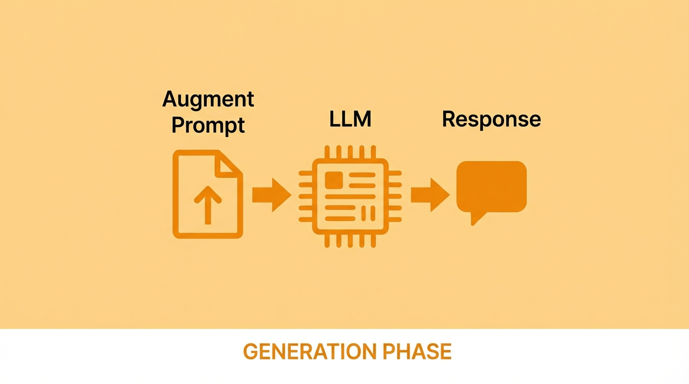
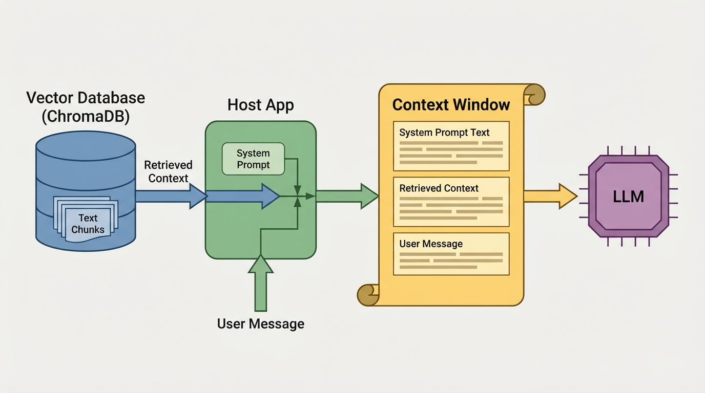

# Module 3: Connect to Chat

**Building the last mile — from retrieval to conversation**



---

# How Does the LLM "Use" RAG?

<!-- This slide is the core conceptual beat of Module 3 -->

It doesn't.

The LLM has **no connection** to your database.
It doesn't know ChromaDB exists.
It doesn't call any retrieval API.

It only sees what's placed in the **context window**.

---

# The Context Window Is the Only Door



<!--
Speaker notes:
- "You built the retrieval pipeline in Modules 1 and 2. Now we connect it to an LLM."
- "But 'connect' is misleading — there's no wire, no API call from the LLM to ChromaDB."
- "The retrieval system fetches relevant chunks and pastes them into the prompt."
- "This is simpler than most people expect."
- CALL OUT: "Notice what's NOT here — there is no line from the Vector Database directly to the LLM. The LLM has zero awareness that a database exists. The Host App does all the work."
-->

---

# What Goes Into the Context Window?

Three things get assembled into every request:

| Component | Who controls it | What it does |
|---|---|---|
| **System Prompt** | You (the developer) | Sets behavior, personality, rules |
| **Retrieved Context** | RAG pipeline | Relevant chunks from your documents |
| **User Message** | The end user | Their question |

The LLM sees **all three combined** as one input. It responds accordingly.

<!--
Speaker notes:
- The system prompt is your steering wheel
- The retrieved context is the knowledge you're injecting
- The user message is what drives the query
- The LLM doesn't distinguish between these — it's all just text
-->

---

# The Host App: Your RAG Orchestrator

Your application — not the LLM — does all the work:

1. **Receives** the user's question
2. **Queries ChromaDB** for relevant chunks
3. **Assembles** the context window (system prompt + retrieved context + user message)
4. **Sends** the complete prompt to the LLM

The LLM never touches the database. The host app is the bridge.

<!--
Speaker notes:
- "The host app is the orchestrator. It's a regular Python application."
- "For those curious, this is all in app.py in the chat-rag-explorer repo."
- Point at the architecture diagram from slide 3 — "The Host App box is doing ALL of this."
- "The LLM is just a text-in, text-out API. Your app does the retrieval, the assembly, everything."
-->

---

# The System Prompt: Guiding the LLM

Your default system prompt tells the LLM how to use the retrieved context:

```
You are a helpful assistant.

When context from a knowledge base is provided
(in <knowledge_base_context> tags), use it to
inform your response. Prioritize information from
the provided context when answering questions.

If the context doesn't contain relevant information,
say so clearly rather than guessing.

Cite the source document when possible.
```

This is the **only bridge** between the LLM and your RAG system.

<!--
Speaker notes:
- Open Settings → System Prompt in the app to show this live
- "This is what you all have as your default. The LLM knows to look for context tags, prioritize that context, cite sources, and admit when it doesn't know."
- "Without this prompt, the LLM would receive the same retrieved chunks but have zero instructions about what to do with them."
- "Remember: no direct connection. This prompt is the ONLY way the LLM knows RAG exists."
-->

---

# Our Dataset: The Morn Chronicles

A **Star Trek: Deep Space Nine** fan fiction — ~60,000 words of entirely invented content the LLM has never seen.

| Morn Chronicles | Your World |
|---|---|
| Invented Lurian biology | Internal company docs |
| Morn's backstory | Product documentation |
| Warren family structure | Customer support knowledge base |
| Heist details | Proprietary research & reports |

**The common thread:** Content not in the LLM's training data. RAG is the bridge.

<!--
Speaker notes:
- "Before we demo, let's talk about what data we're working with."
- Quick show of hands: "Anyone a Star Trek fan?"
- Explain Morn: beloved background character who never speaks on screen — we wrote a novel about his life
- Walk through the table: each row maps invented content to a real-world equivalent
- "This is a stand-in for YOUR data. Internal docs, product specs, support articles — anything the LLM hasn't seen."
-->

---

<!-- _class: lead -->

# Live Demo

## Chat RAG Explorer

`http://127.0.0.1:8000`

<!--
Speaker notes:
PRE-DEMO CHECK (2 min):
- Verify your .env has a valid OPENROUTER_API_KEY (It's been emailed to you via Luma)
- Helpers: spot-check a few participants' .env files
- If anyone needs an API key: https://openrouter.ai/keys — free tier works for this workshop
- Confirm the app is running: http://127.0.0.1:8000

TERMINOLOGY: The syllabus says "debug window" — in the app it's the "Details" button. Same feature.

DEMO FLOW:
1. Show the main chat UI — point out sidebar (model, tokens, parameters, RAG toggle)
2. Point out RAG is enabled, connected to Morn Chronicles collection
3. Note the system prompt is the RAG-aware one we just discussed
4. Send first query: "What is the Lurian First Molt?"
   - This is entirely INVENTED content — it does NOT exist in LLM training data
   - The ONLY way the LLM can answer is through the retrieved context
5. Get response — should be good: uses context, cites sources
6. Click Details to show the augmented message with <knowledge_base_context> tags
7. "Look — the system prompt told the LLM to use this context. And it did."
8. KEY POINT: "The host app retrieved the chunks, assembled the prompt, and the system prompt guided the LLM. That's the full RAG loop."
-->

---

<!-- _class: lead -->

# Launch Your App

## Everyone: open your Chat RAG Explorer

`http://127.0.0.1:8000`

**Already running?** You should see the chat interface.
**Not running?** Start it now:

```bash
cd chat-rag-explorer
uv run python app.py
```

<!--
Speaker notes:
- "Now it's your turn — everyone open the app."
- Give the room ~2 minutes to get running
- Helpers: circulate and assist anyone who can't connect
- Common issues: port conflict (another process on 8000), missing .env, ChromaDB not populated
- Once most people have the UI open, move on — stragglers can catch up
-->

---

# What Did the LLM Actually Receive?

Open the **Details** view on any response to see the augmented message:

```xml
<knowledge_base_context>
  <document index="1">
    ...retrieved chunk from ChromaDB...
  </document>
  <document index="2">
    ...another retrieved chunk...
  </document>
</knowledge_base_context>

<original_user_message>
  What is the Lurian First Molt?
</original_user_message>
```

The RAG context was **already there**. The system prompt told the LLM how to use it.

---

# Aside: Without a RAG-Aware Prompt

What if the system prompt didn't mention the retrieved context?

```
You are a helpful assistant.
```

- No mention of `<knowledge_base_context>`
- No citation instructions
- No guidance on what to do when context is missing

The LLM still **receives** the same retrieved chunks — but has no instructions to use them.

<!--
Speaker notes:
- Switch to the basic prompt in Settings (instructor has this prepared)
- Send the same query: "What is the Lurian First Molt?"
- Show the degraded response — may partially use context, no citations, inconsistent
- "Same retrieved context. Same LLM. The only difference is the system prompt."
- "This is why the system prompt is the only bridge. Remove the instructions, and the LLM doesn't know what to do with the context it receives."
- Switch back to the RAG-aware prompt before moving on
-->

---

# Same Context, Different Instructions

| | RAG-Optimized Prompt | Basic Prompt |
|---|---|---|
| **Uses retrieved context** | Yes, prioritizes it | Maybe, inconsistently |
| **Citations** | References source docs | None |
| **Missing info handling** | Says "I don't know" | May hallucinate |
| **Output quality** | Consistent, grounded | Unpredictable |

The **only thing that changed** was the system prompt.
The retrieved context was identical. The host app did the same work.

---

<!-- _class: lead -->

# Your Turn

## Interactive Testing

<!--
Speaker notes:
PARTICIPANT ACTIVITY (5 min):
- Everyone send queries to the chat app
- Try different questions against the Morn Chronicles corpus
- Open Details on responses to see the augmented message
- Experiment with the system prompt if time allows

SUGGESTED QUERIES (share these):
- "What is the Lurian First Molt?" — invented biology, not in training data
- "How many siblings does Morn have? Name some of them." — detailed retrieval test
- "What is a kelvu and what did Morn store in his?" — invented term + canon fact
- "Describe the planet Luria and the city of Luralis" — worldbuilding retrieval
- "What happened during the Lissepian Mother's Day Heist?" — canon event + invented detail
- "What is Captain Picard's favorite tea?" — NOT in this corpus, tests missing context handling

DEBUGGING EXERCISE — Retrieval vs. Generation Problems:
Walk through two scenarios to teach participants how to diagnose issues:

1. RETRIEVAL FAILURE:
   - Ask: "What is Captain Picard's favorite tea?"
   - Click Details — the retrieved chunks are irrelevant (nothing about Picard in this corpus)
   - Diagnosis: the retrieval system found nothing useful. This is a RETRIEVAL problem.
   - Fix: add relevant documents, or adjust retrieval parameters.

2. GENERATION FAILURE:
   - Ask: "What is the Lurian First Molt?" using the basic "You are a helpful assistant" prompt
   - Click Details — the retrieved chunks ARE relevant (correct Morn Chronicles content)
   - But the response may be vague, miss details, or not cite sources
   - Diagnosis: retrieval worked, but the LLM didn't use the context well. This is a GENERATION problem.
   - Fix: improve the system prompt (switch to the RAG-optimized prompt).

KEY POINT: "Always check Details first. Right chunks = generation problem. Wrong chunks = retrieval problem."
-->

---

# Try Your Own Corpus

If you built a corpus in Module 2:

1. Go to **Settings → RAG Settings**
2. Set ChromaDB Path to your local database
3. Click **Test Connection**
4. Select your collection
5. **Save Settings**
6. Return to chat and query your own documents

Don't have one? Stay on the Morn Chronicles — it works great for exploring.

<!--
Speaker notes:
- Helpers assist anyone switching to their own corpus
- This is optional — don't hold up the group
- Some may not have completed Module 2's corpus
- The Morn Chronicles corpus is a perfectly valid learning experience
-->

---

# Key Takeaways

- The **host app** (`app.py`) is the orchestrator — the LLM has no direct connection to your database
- RAG = host app retrieves text, assembles the prompt, sends to the LLM
- The **context window** is the only door to the LLM
- The **system prompt** is the only bridge — it tells the LLM how to use the retrieved context
- Full pipeline visibility (Details view) lets you **debug** whether a problem is retrieval or generation

---

# What's Next: Extending the RAG Explorer

The Chat RAG Explorer is a **learning tool** — here's where to take it next:

- **Multiple Collections** — query different datasets, compare results
- **Hybrid Search** — combine keyword + semantic retrieval for better results
- **MCP Integration** — make the LLM aware of search capabilities via system prompt, or go further with MCP tools
- **Agent Skills** — automated retrieval strategies that adapt to the query

We'll talk about the bigger picture in the **Wrap-Up**.

<!--
Speaker notes:
- "This app is intentionally simple. These are the natural next additions."
- "Multiple collections means you could search docs AND support tickets from one interface."
- "Hybrid search pairs what we built (semantic) with traditional keyword search."
- "MCPs and Agent Skills are how you make the LLM more active — instead of just receiving context, it can request specific searches."
- "We'll cover the broader learning path in Wrap-Up."
-->
