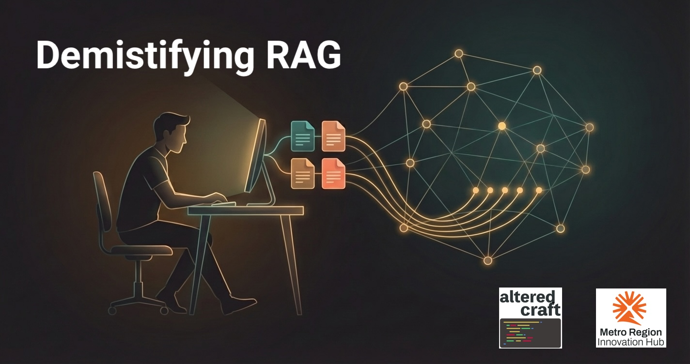
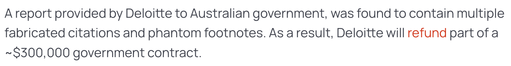
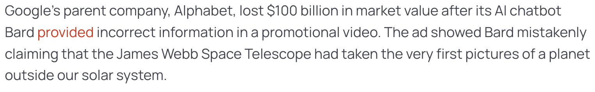
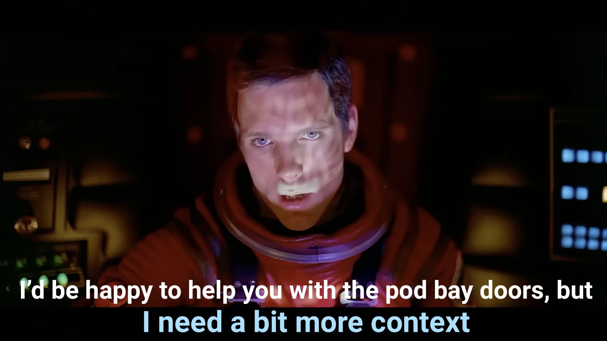
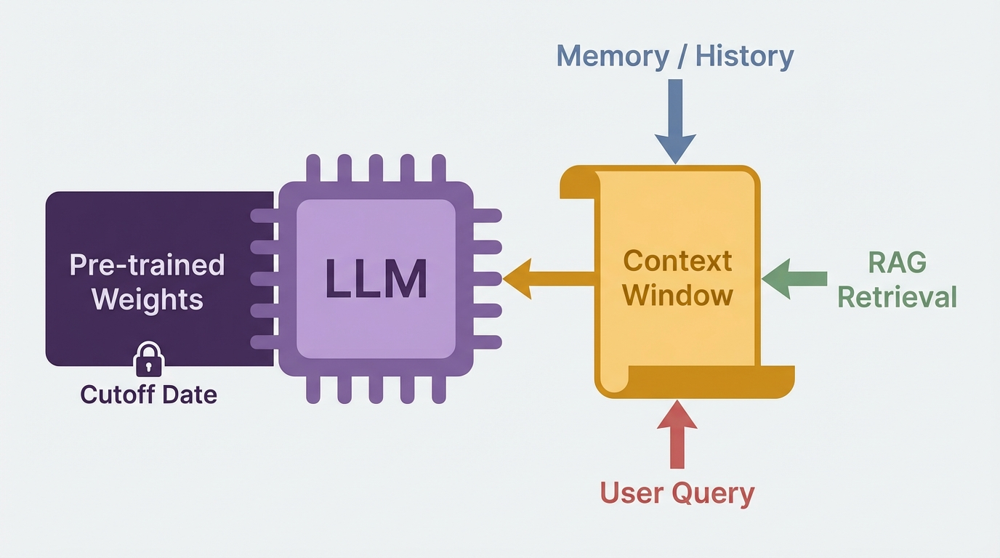
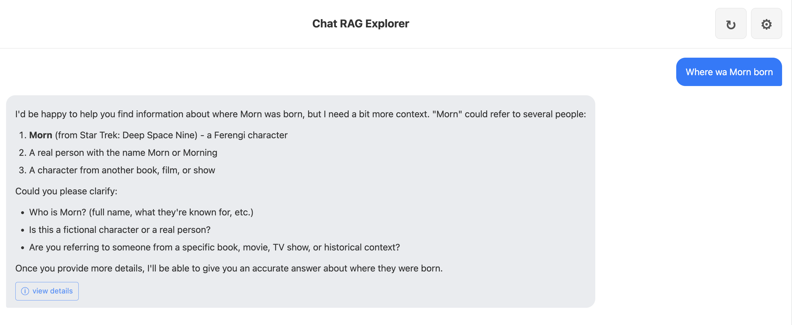
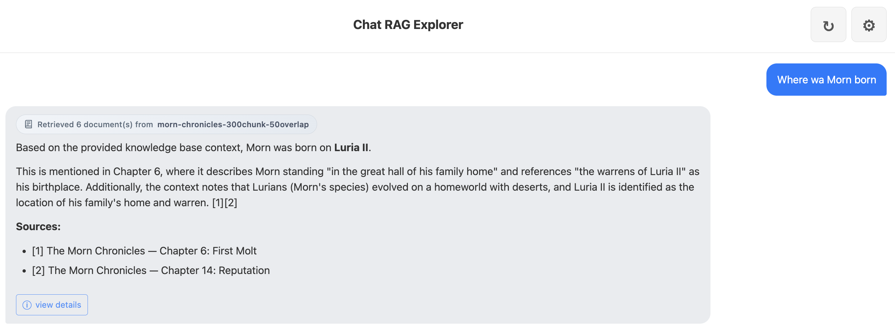
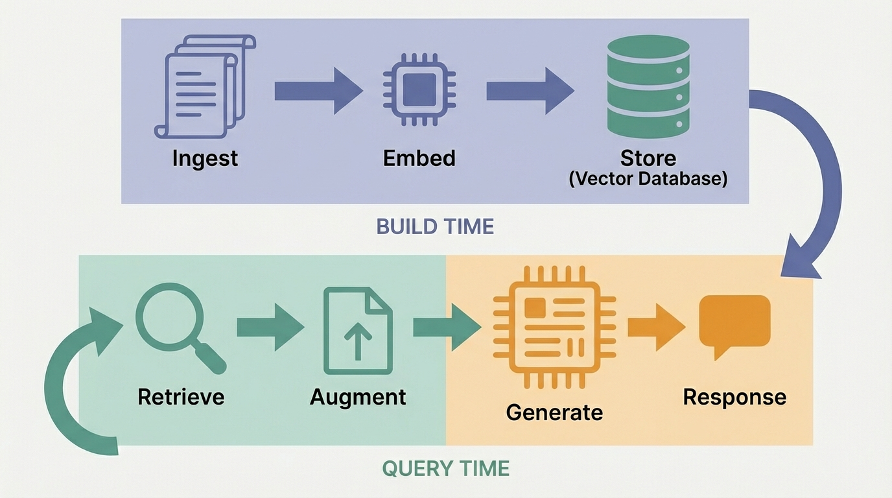

# Build Your Own AI-Powered Document Search

<!--
Speaker notes:
- Welcome everyone
- Introduce yourself and the other instructors
- Logistics: 2-hour session, 3 modules with a break, 3 speaker, we'll be alternating sections
- "By the end of today, you'll understand RAG from a wholistic perspective"
-->

---

# Introductions

<!-- 
- Introduce Mark and Daniel
- Thank Metro Region Innovation Hub for hosting us
- 
-->
---

# The Problem

<!--
Speaker notes:
- "Let's start with a problem you've probably seen."
- Show the hallucination examples — the LLM confidently states something wrong
- "These aren't bugs. The LLM is doing exactly what it's designed to do — generating plausible text based on its training data."
- "When the training data doesn't cover your question, it fills in the gaps. Confidently."
-->

---

# Even Without Hallucinations

<!--
Speaker notes:
- "But hallucinations aren't the only issue."
- "Even when the LLM doesn't hallucinate, it simply can't answer about data it was never trained on."
- "Your internal docs, your product specs, your customer data — none of that is in the training set."
- "The LLM doesn't need to be wrong to be useless. It just needs to not have the information."
-->

---

# There Is Only Context

<!--
Speaker notes:
- "An LLM has exactly two sources of knowledge."
- "First: its pre-trained weights — everything it learned during training, frozen at a cutoff date. You can't change this at inference time."
- "Second: the context window — whatever text you put in front of it right now."
- "That's it. There is no third option."
- "RAG, memory systems, user queries — they all work through the same single mechanism: the context window."
- "If it's not in the weights and not in the context, the LLM cannot know it."
- "This is the fundamental insight of today's workshop. RAG is simply a system for getting the right context into that window."
-->

---

# The Components of RAG

A complete **Retrieval-Augmented Generation** pipeline:

1. **Ingest & Embed** — turn documents into searchable vectors
2. **Query & Retrieve** — find relevant content by meaning
3. **Chat Interface** — connect retrieval to an LLM

By the end, you'll have all three running locally.

<!--
Speaker notes:
- Walk through the three phases of the diagram
- "Ingestion is a one-time setup — you chunk your documents and store them as vectors."
- "Retrieval happens at query time — finding the most relevant chunks."
- "Generation is where the LLM comes in — but only after retrieval has done its job."
-->

---

# Without RAG

We built a **Star Trek fan fiction** corpus — 60,000 words of content the LLM has never seen.

The LLM doesn't know our content. It guesses, hedges, or hallucinates.

<!--
Speaker notes:
PREFERRED — Live demo:
1. Open the Chat RAG Explorer app (http://127.0.0.1:8000)
2. Disable RAG (toggle off in sidebar)
3. Ask: "What species is Morn?"
4. Show the hallucination — LLM calls him Ferengi or guesses incorrectly
5. "This is what happens without context. The LLM doesn't have our data."

BACKUP — If live demo isn't available, use these slides:
- Point out: "This isn't a failure of the LLM — it simply doesn't have this information."
- Walk through the screenshot: the LLM confidently misidentifies Morn's species
- "It even calls him Ferengi instead of Lurian — because that's what its training data suggests."
-->

---

# With RAG

Same question. Same LLM. But now with **retrieved context** from our document database.

Correct answer. Citations. Confidence.

<!--
Speaker notes:
- "The LLM didn't get smarter. It got context."
- "That's RAG. That's what we're building today."
-->

---

# What is RAG?

**Retrieval-Augmented Generation**

Instead of hoping the LLM knows the answer, we:

1. **Retrieve** relevant documents from a database
2. **Augment** the prompt with that content
3. Let the LLM **Generate** a response using the provided context

The LLM doesn't get smarter. It gets **context**.

---

# The RAG Loop

<!--
Speaker notes:
- "There are two distinct phases here."
- "Build time: you ingest, chunk, embed, and store your documents. You do this once (or when your data changes)."
- "Query time: a user asks a question, you retrieve relevant chunks, augment the prompt, and generate a response. This happens every time."
- "Today we build both sides — Modules 1 and 2 cover build time, Module 3 covers query time."
-->

Today we build each step:

| Module | What you'll build |
|---|---|
| **Module 1** | Ingest & Embed documents |
| **Module 2** | Query & Retrieve |
| **Module 3** | Connect to Chat |

---

# Discussion

- Has anyone used ChatGPT or another LLM on their own documents?
  What happened?

- What information does an LLM **not** have access to?

<!--
Speaker notes:
- This is a quick 2-3 minute discussion, not a deep dive
- Expected answers: "It made stuff up", "It didn't know my internal docs", "It was outdated"
- Bridge to: "Those are exactly the problems RAG solves. Let's build one."
-->

---

<!-- _class: lead -->

# Let's Build

## Module 1: Ingest & Embed

<!--
Speaker notes:
- Hand off to Mark for Module 1
- "Mark is going to walk you through turning our Morn Chronicles documents into vectors in ChromaDB."
-->
